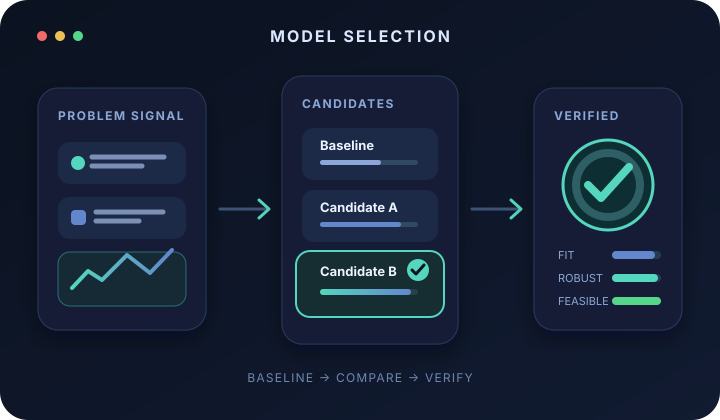
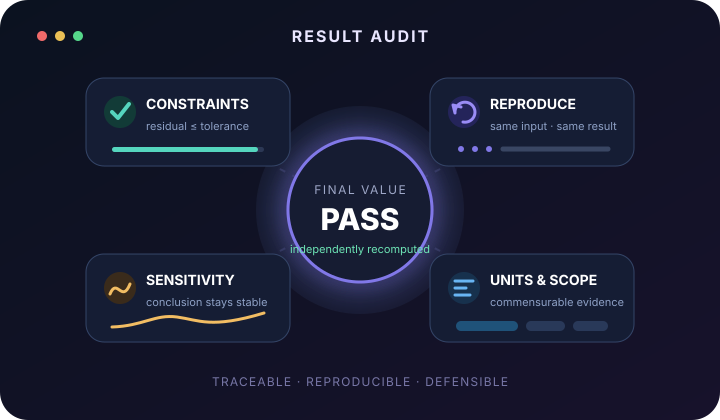
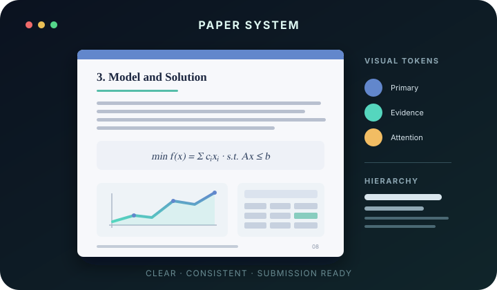

<p align="center">
  
</p>
  
<h1 align="center">Math Modeling Workbench</h1>

<p align="center">
  <strong>数学建模工作台</strong><br>
  让 Codex 先把答案做对，再把论文做漂亮。
</p>

<p align="center">
  
  
  
  
  <a href="LICENSE"></a>
</p>

<p align="center">
  <a href="#快速开始">快速开始</a> ·
  <a href="#六阶段工作流">工作流</a> ·
  <a href="#数学建模竞赛稀疏检索-rag">RAG</a> ·
  <a href="#论文与科研图表">论文与图表</a> ·
  <a href="#验证">验证</a>
</p>

---

> Math Modeling Workbench 不是“一次生成整篇论文”的提示词集合，而是一条可追踪的竞赛建模流水线：拆题、检索、选模、求解、制图、写作和验收都有明确产物与质量门禁。

## 为什么使用它

<table>
  <tr>
    <td width="50%" valign="top">
      <h3>🎯 先保证答案可信</h3>
      <p>按数学结构检索历史题与算法卡，先建立可解释基线，再比较候选模型；对硬约束、量纲、数据泄漏、灵敏度和可复现性进行显式检查。</p>
    </td>
    <td width="50%" valign="top">
      <h3>🎨 再提升论文表现</h3>
      <p>提供 Typst / LaTeX 双引擎模板、科研绘图脚本和 DrawIO 图示流程，让图表、公式、章节和视觉风格共同服务论文论证。</p>
    </td>
  </tr>
  <tr>
    <td width="50%" valign="top">
      <h3>🧠 离线建模 RAG</h3>
      <p>覆盖 CUMCM 2000–2025 A/B/C 题及五类跨赛精选案例。检索只提供结构类比和检查清单，不把历史解法冒充当前题目的标准答案。</p>
    </td>
    <td width="50%" valign="top">
      <h3>✅ 提交前硬门禁</h3>
      <p>检查章节、图表、引用、关键数值、结果证书、编译和 PDF 视觉质量；发现硬错误时回退修复，而不是用润色掩盖问题。</p>
    </td>
  </tr>
</table>

## 六阶段工作流


| 阶段 | Skill | 关键产物 |
| --- | --- | --- |
| 1. 启动与规划 | `1start-mathmodel` | `plan.md`、`todo.md` |
| 2. 分析、选模与冻结 | `2analysis-modeling` + `mathmodel-rag` | `TASK_CONTRACT.md`、`ANALYSIS_MODELING_REPORT.md`、`RAG_CONTEXT.md`、`MODEL_FREEZE.json` |
| 3. 求解与数据图 | `3coding-visual` | 可复现代码、结果证书、数据图、`RESULTS_REPORT.md` |
| 4. 非数据图示 | `4drawio` | 技术路线图、模型结构图、可编辑 DrawIO 源文件 |
| 5. 论文写作 | `5writing` | Typst / LaTeX 论文工程和 PDF |
| 6. 最终验收 | `6verity` | `VERIFY_REPORT.md` 与 PASS / FAIL 结论 |

启动阶段还会生成 `reports/INPUT_INVENTORY.md` 和 `reports/WORKFLOW_STATE.json`：前者对 CSV、TSV、XLSX、PDF 等附件做本地有界预检，后者用于在中断后从第一个未完成阶段恢复。用户可选的 `project-profile.json` 用于复用本人提供的比赛、排版和队伍信息，但每次仍以当届规则和本次选择为准。

状态更新使用原子写入脚本，避免应用或命令中断时留下损坏的半截 JSON：

```bash
python plugins/math-modeling-workbench/scripts/manage_workflow_state.py \
  path/to/project set analysis complete --actor 2analysis-modeling \
  --artifact reports/MODEL_FREEZE.json
```

### 角色责任与模型参数冻结

每个阶段只能修改自己拥有的产物。建模阶段在正式求解前冻结数据口径、模型族、固定参数或训练内选择规则、约束、求解器、停止条件和验收标准；代码、制图、写作与验收阶段只能读取冻结内容并生成角色回执。

```bash
# 分析阶段：填写 MODEL_FREEZE.json 后封印
python plugins/math-modeling-workbench/scripts/model_freeze.py path/to/project seal

# 代码阶段：检查上游文件哈希并接受当前版本
python plugins/math-modeling-workbench/scripts/model_freeze.py path/to/project check
python plugins/math-modeling-workbench/scripts/model_freeze.py path/to/project \
  accept --role 3coding-visual
```

冻结文件或其上游报告发生变化后，旧回执与结果证书会自动失效。下游若发现模型需要实质变更，只能提交变更请求并退回分析阶段重新修订、封印和运行，不能在代码或论文中静默改变口径。

## 数学建模竞赛稀疏检索 RAG

RAG 默认离线运行，不需要 API Key 或外部向量数据库。它使用中文字符 2/3-gram BM25、查询扩展、字段加权和知识类型配额，在一次检索中组合案例、算法和验证策略。

| 内容 | 数量 |
| --- | ---: |
| 历史子问题知识块 | 333 |
| 整题任务链与结构画像 | 99 |
| 算法知识卡 | 25 |
| 建模与验证策略卡 | 20 |
| **知识块合计** | **477** |

覆盖范围包括：

- CUMCM 2000–2025 A/B/C；
- 深圳杯、MathorCup、电工杯、五一数学建模竞赛；
- 中国研究生数学建模竞赛（华为杯）精选题；
- 预测、评价、优化、图论、统计、机器学习、机理模型和稳健性分析等通用范式。

支持按年份或题号排除历史题，用于前向测试和同题泄漏检查：

```bash
python plugins/math-modeling-workbench/skills/mathmodel-rag/scripts/retrieve_modeling_kb.py \
  "需要预测未来需求，并在容量和风险约束下制定资源配置方案" \
  --top-k 12 \
  --exclude-year 2024 \
  --format prompt
```

## 论文与科研图表

内置 17 个竞赛模板族，每个模板同时提供 Typst 与 LaTeX 版本，覆盖中文、英文和主流数学建模赛事。数据图由可复现脚本生成，概念图和流程图保留可编辑源文件。

下面三张首页插图均为本仓库从零绘制的原创 SVG，用于说明选模、验算和排版三条质量链路；它们不是科研数据模板或外部项目截图。

<table>
  <tr>
    <td align="center" width="33%">
      <br>
      <sub>候选模型比较</sub>
    </td>
    <td align="center" width="33%">
      <br>
      <sub>结果证据链</sub>
    </td>
    <td align="center" width="33%">
      <br>
      <sub>论文视觉系统</sub>
    </td>
  </tr>
</table>

除预制模板外，工作流还会根据实际问题生成预测诊断、误差分布、敏感性、Pareto 前沿、约束可行性和空间分析等论文图表。所有图表必须来自真实数据或明确标注的模拟数据。

<details>
<summary><strong>查看 v1.0.0 的准确性与治理能力</strong></summary>

<br>

- 几何运动题检查连续首次接触、整条路径最小裕度、刚性长度和速度传播。
- 抽样检验明确原假设、备择假设、两类错误、OC / ASN，并审计可选停时。
- 返工和拆解决策使用闭合递归状态，验证最终吸收及成本只计一次。
- 多年种植规划逐项检查容量、适种、季间联动、重茬和滚动豆类约束，并从原始方案重算目标值。
- 公开论文或代码只有在单位、时间范围、统计口径和硬约束状态一致时才参与误差计算。
- 求解阶段生成统一结果证书，记录运行命令、数值指标、硬约束残差和同口径比较。
- 分析阶段封存模型、参数、随机种子、容差、数据划分、评价指标和验收阈值，下游阶段必须签收同一冻结版本。
- 六个工作阶段采用明确的角色责任边界；越权修改、阶段跳跃、上游产物漂移和结果证书哈希不一致会被验收门禁拦截。

这些规则来自历史赛题的离线回放，但插件不内置评测题数值答案，避免把记忆旧答案误当成新题泛化能力。

</details>

## 快速开始

### 1. 克隆仓库

```bash
git clone https://github.com/youyou755939/MathModelingWorkbench.git
cd MathModelingWorkbench
```

### 2. 添加 Marketplace 并安装插件

```bash
codex plugin marketplace add .
codex plugin add math-modeling-workbench@math-modeling-workbench
```

安装后请新建一个 Codex 任务，使新的 Skills 被完整加载。

### 3. 开始建模

把赛题 PDF、数据附件或题目文本交给 Codex，然后直接描述目标：

```text
使用数学建模工作台完成这道赛题。先拆解问题并检索 RAG，
比较候选模型后运行可复现代码，最后生成 LaTeX 论文并完成提交前验收。
```

也可以只运行某个阶段：

| 需求 | 示例 |
| --- | --- |
| 只分析和选模 | `分析这道赛题，并用 RAG 比较候选模型。` |
| 只实现求解 | `根据建模报告实现代码，输出结果证书和论文图表。` |
| 只写论文 | `使用国赛 LaTeX 模板，根据现有结果撰写论文。` |
| 只做验收 | `检查这个数学建模项目是否具备提交条件。` |

### 附件预检与本地诊断

附件较多或数据较大时，可以先生成结构清单：

```bash
python plugins/math-modeling-workbench/scripts/inspect_project_inputs.py path/to/project
```

需要反馈环境问题时，可以生成经过最小化和脱敏设计的本地报告：

```bash
python plugins/math-modeling-workbench/scripts/collect_diagnostics.py \
  --project-root path/to/project
```

诊断脚本不读取环境变量值、API Key 或附件正文，也不会自动上传。分享前仍应由用户人工检查。

## 目录结构

```text
MathModelingWorkbench/
├── .agents/plugins/marketplace.json
└── plugins/math-modeling-workbench/
    ├── .codex-plugin/plugin.json
    ├── assets/
    ├── scripts/
    └── skills/
        ├── 1start-mathmodel/
        ├── 2analysis-modeling/
        ├── 3coding-visual/
        ├── 4drawio/
        ├── 5writing/
        ├── 6verity/
        ├── mathmodel-rag/
        ├── mathmodel-figure-templates/
        ├── mathmodel-reference/
        ├── typst-author/
        └── doctor/
```

## 验证

验证插件结构、模板配对、RAG 数据库、稀疏索引和检索能力：

```bash
python plugins/math-modeling-workbench/scripts/validate_bundle.py
```

验证单次建模结果证书：

```bash
python plugins/math-modeling-workbench/scripts/validate_result_certificate.py \
  path/to/code/outputs/validation_certificate.json \
  --freeze path/to/reports/MODEL_FREEZE.json
```

验证角色权限、冻结修订、回执失效和篡改检测：

```bash
python plugins/math-modeling-workbench/tests/test_governance.py
```

通过时应看到：

```text
PASS manifest
PASS skills
PASS templates
PASS rag
PASS portability
PASS bundle
```

## 设计边界

- 历史题和算法卡用于提出候选结构，不是官方答案。
- 没有通过约束、复现和一致性检查的结果，不进入论文美化阶段。
- 没有通过模型冻结、角色回执与阶段产物哈希检查的工作流，不进入下游阶段。
- 插件专注于适合 Codex 调用的 Skills、知识库、模板和验收能力，不捆绑独立 Web 应用。
- 模型列表、自由聊天、内置文件预览窗口、自动更新和 Beta 渠道属于 Codex 宿主能力；插件不伪装实现这些界面功能。
- 本项目的补强脚本、状态契约和说明均为独立设计，不包含第三方项目的代码、模板、文案或安装包资源。
- 比赛年度规则可能变化，提交前仍应核对当年官方通知。

## License

[MIT](LICENSE)
